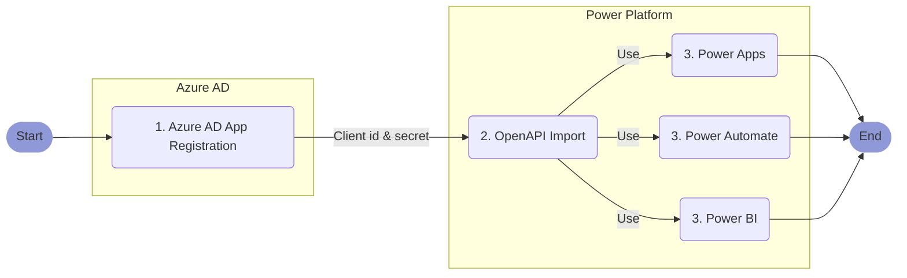

# Use the SalesTim API with Power Platform <Badge text="beta" type="warning"/>
<Classification label="public" />

**Abstract**: This article explains how to register the SalesTim API as a custom connector for the Microsoft [Power Platform](https://powerplatform.microsoft.com). The `SalesTim Connector for Power Platform` gives you access to all the powerful features of our [Governance API](/api/), such as managing your teams or start a new team provisioning job, right from [PowerApps](https://powerapps.com), [Power Automate](https://flow.microsoft.com), or [Power BI](https://powerbi.microsoft.com).

::: tip ⏱ Expected Duration
Creating the `SalesTim Connector for Power Platform` only requires a few operations that are described hereafter as a detailed step-by-step procedure. Assuming you have all the required access and permissions to execute it properly, it should take ***less than 10 minutes***.
:::

**Table of Contents**:
[[toc]]

## Procedure Overview



## 1. Create a new app registration in Azure Active Directory
To securely access your Microsoft 365 environment through the Microsoft Graph APIs, the first step is to create a dedicated app registration. An Azure AD app registration identifies a third-party app such as SalesTim, and defines the permissions you wan to grant to it. To learn more, you can refer to [How and why applications are added to Azure AD](https://docs.microsoft.com/en-us/azure/active-directory/develop/active-directory-how-applications-are-added).

To create a new app registration, follow these steps:
1. Open your [Azure Active Directory portal](https://portal.azure.com/#blade/Microsoft_AAD_IAM/ActiveDirectoryMenuBlade/Overview)
2. Select `App registrations` from the left menu
3. Click `New registration` from the top bar
4. Give the app a name, such as:
```
SalesTim Power Platform Connector
```
5. Select the option `Accounts in this organizational directory only`, as you want to restrict access to your own tenant.
6. Use this web redirection URL:
```
https://global.consent.azure-apim.net/redirect
```
7. Click `Register`
8. From the `Overview` menu, copy the `Application (client) ID`, and keep it as we're gonna reuse it later. You can temporarily paste it here:

**Application (client) ID**:  
<input type="text" id="clientIdInput" style="width: 500px;" placeholder="Paste your Application ID here"></input>

9. Open the `Certificates and secrets` menu and click `New client secret`. A client secret is a kind of a password for your app, so manage it carefully.
10. Give a name to your client secret such as:
```
SalesTim Power Platform Connector client secret
```
11. Select the option `Never` to prevent this secret to expire in the future, and click `Add`
12. Copy the `Client secret` value (be careful, it will only be shown once), and keep it as we're gonna reuse it later. You can temporarily paste it here:

**Client secret**:  
<input type="text" style="width: 500px;" placeholder="Paste your Client Secret here"></input>

13. Open the `API permissions` from the left menu and click `Add a permission` from the top bar
14. Select `Microsoft Graph`, then `Delegated permissions`
15. From the permissions list, select:
    - OpenId permissions >
        - `email`
        - `offline_access`
        - `openid`
        - `profile`
    - Directory >
        - `Directory.AccessAsUser.All`
    - Group >
        - `Group.ReadWrite.All`
    - InformationProtectionPolicy >
        - `InformationProtectionPolicy.Read`
    - Mail >
        - `Mail.Send`
    - User >
        - `User.Read`
        - `User.Read.All`
16. Click `Add permissions`
17. Then click `Grant admin consent for...` then `Yes`

You're done, you've created your app registration for the SalesTim Connector. You should also have saved for later the `Application (client) ID` and `Client secret` that we're gonna use in the next steps.

## 2. Import the SalesTim OpenAPI definition
Now that we've created the app registration, we're gonna use it to create our custom connector.

1. To import the SalesTim API OpenAPI definitions for Power Automate and Power Apps, go to [PowerApps](https://powerapps.com) or [Power Automate](https://flow.microsoft.com).

::: tip
The custom connector you're about to create will be available for both PowerApps and Power Automate, as they're sharing the same list of connectors.
:::

2. In the navigation pane, select `Data` then `Custom connectors`.
- Select `New custom connector` then choose `Import an OpenAPI from URL`
- Give your connector a name, such as :
```
SalesTim Connector
```
3. Paste this URL:
```
https://developers.salestim.com/api/definitions/v1.0/open-api/apiDefinition.swagger.yaml
```
4. Click `Import`, then `Continue`
5. Upload the connector logo that you can download from:
```
https://www.salestim.com/wp-content/uploads/2019/05/color.png
```
6. Set the icon background color to:
```
#000000
```
7. Click `Security`
8. Ensure that the authentication type is set to `OAuth 2.0` and the identity provider is set to `Azure Active Directory`
9. Paste the previously copied `Client id` and `Client secret`
10. Ensure that the login url is set to:
```
https://login.windows.net
```
11. Ensure that the tenant ID is set to:
```common```
12. Set the resource URL to:
```
https://graph.microsoft.com
```
13. Set the scope to:
```
https://graph.microsoft.com/.default
```
14. Click `Create connector`, then `Close`

## 3. Next Steps
Now that you've created the `SalesTim Connector for Power Platform`, you can use it from both [Power Apps](https://powerapps.com), [Power Automate](https://flow.microsoft.com), and [Power BI](https://powerbi.microsoft.com).

::: tip To Go Further
Here are a few interesting articles that may give you some guidelines and new ideas on how to use the the `SalesTim Connector for Power Platform`:
- [Power Automate with Microsoft Teams: The Full Tutorial with Examples](https://www.salestim.com/power-automate-with-microsoft-teams-the-full-tutorial-with-examples/)
- [Get started with Power Automate](https://docs.microsoft.com/en-us/power-automate/getting-started)
- [Power BI with Microsoft Teams: How to Manage Reports Effectively](https://www.salestim.com/power-bi-with-microsoft-teams-how-to-manage-reports-effectively/)
:::
